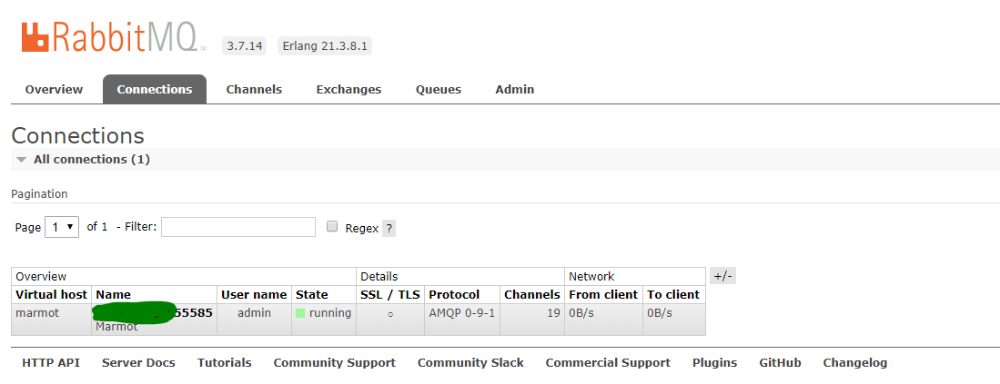
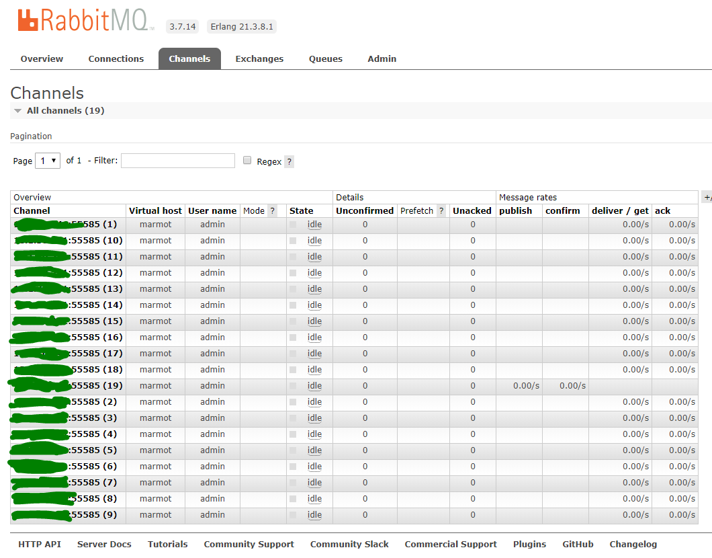
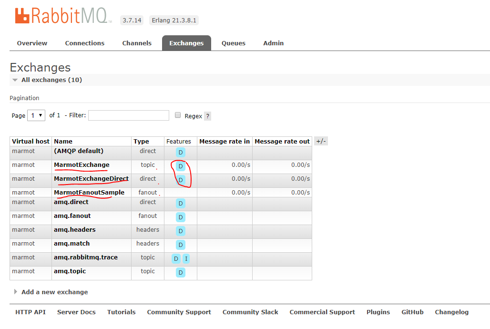
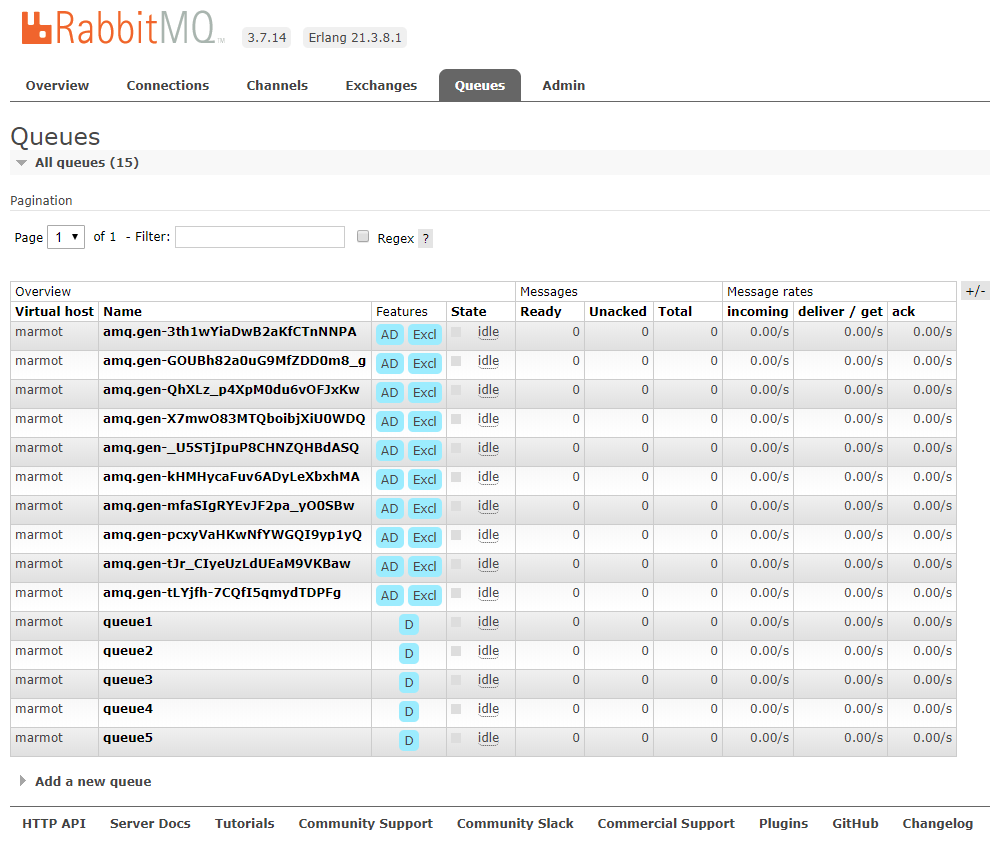
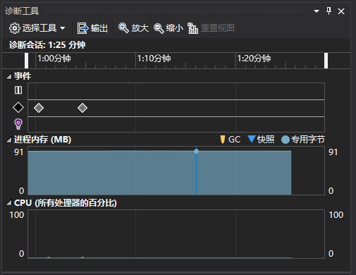

# Marmot
Marmot is a multi-threaded connection pooling secure for RabbitMQ client that supports Fanout, Direct, and Topic modes.Support DI.

# You should Know
- The encoding format of transmission is UTF-8.
- When Fanout and Direct,default autoAck is true

# How To Use

## Startup.cs
``` C#
public void ConfigureServices(IServiceCollection services)
{
    services.UseMarmotMQ(opt =>
    {
        opt.HostName = "10.1.30.251";
        opt.Port = 5672;
        opt.UserName = "admin";
        opt.Password = "admin";
        opt.VirtualHost = "/";
    });
    services.AddMvc().SetCompatibilityVersion(CompatibilityVersion.Version_2_2);
    services.AddSwaggerCustom(Configuration, "MarmotTopicTest", "v1", UseValidateForSwagger, "MarmotTopicTest");
}
```

## Fanout
* Consumer
```C#
Task.Factory.StartNew(() =>
{
   await fConsumerClientFactory.Create("MarmotFanoutSample",
        (sender, e, channel) =>
        {
            Console.WriteLine($"RoutingKey:{e.RoutingKey},Body:{ Encoding.UTF8.GetString(e.Body)}");
            Console.WriteLine();
        }).StartListen(new TimeSpan(30000), new System.Threading.CancellationToken());
});
```

* Publisher
``` C#
await fPublish.PublishAsync(3333, "MarmotFanoutSample");
```

## Topic
* Consumer
```C#
 topicConsumerClientFactory.Create("MarmotExchange", "topic", queueName, true, false, (sender, e,consumer) =>
            {
                Console.WriteLine($"Queue:{queueName},RoutingKey:{e.RoutingKey},Body:{ Encoding.UTF8.GetString(e.Body)}");
                Console.WriteLine();
                consumer.BasicAck(e.DeliveryTag, false); //<-- how to ack
                //channel.BasicReject(deliveryTag, true); //<--how to reject
            }).StartListen(new[] { "aaa", "ljh-publish", "FF.#" }, new TimeSpan(30000), new System.Threading.CancellationToken());
```

* Publisher
``` C#
publishMessageSender.PublishAsync(new Person()
{
    Id = "0",
    Name = "xiaoming"
}, "MarmotExchange", "topic", "aaa", true, false, null);

publishMessageSender.PublishAsync(new Person()
{
    Id = "1",
    Name = "xiaoming1"
}, "MarmotExchange", "topic", "FF.933", true, false, null);

```

## Direct
* Consumer
``` C#
dConsumerClientFactory.Create("MarmotExchangeDirect","",
    (sender, e,channel) =>
    {
        var body = e.Body;
        var message = Encoding.UTF8.GetString(body);
        var routingKey = e.RoutingKey;
        Console.WriteLine(" [x] Received '{0}':'{1}'", routingKey, message);
    }).StartListen(new[] { "aaa", "bbb", "cc" },
    new TimeSpan(30000), 
    new System.Threading.CancellationToken());
```
* Publisher
``` C#
await dPublish.PublishAsync(2333322,"aaa", "MarmotExchangeDirect");
```
# Example ScreenShot
* opened up several different models Consumers, Here are some screenshots of RabbitMQ Manager.
- 1. Connection

- 2. Channel

- 3. Exchange

- 4. Queue

- 5. Diagnostic situation


# Enjoy Coding

# [License](./Marmot/license.txt)